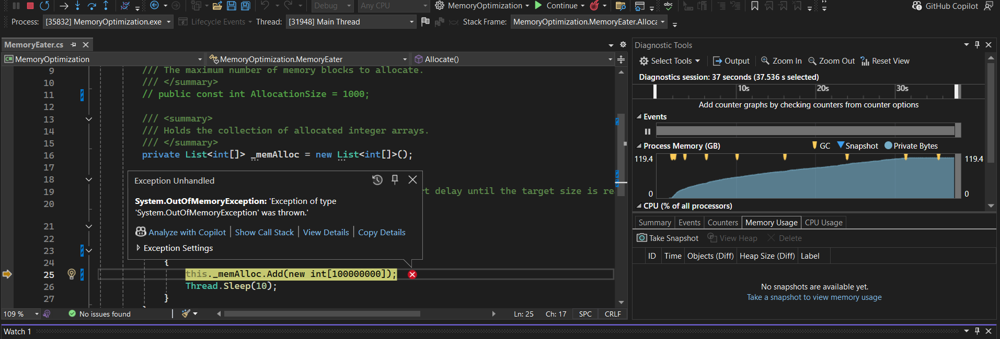
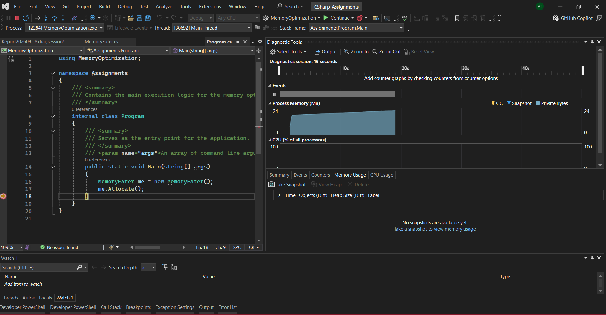

## Task 1 - Identifiying and understanding the memory issue
- Has a memory eater class where the `Allocate()` method has an `while(true)` loop running infinitely, for every iteration a new `int[1000]` array is created and added to the list.

- These newly created arrays are continuously added to a list where the reference is retained by the list and is not being collected by the Garbage Collector resulting in a steady growth of managed heap memory.

- Throws `System.OutOfMemoryException` due to memory leaks.



## Task 2 - Optimized code

- Replace the infintely running loop to a condition based loop 
- Limited the total number of alloction by initializing a constant variable `AllocationCount` to `1000`
- loop ends when the list count reaches the `AllocationCount` making the execution finite

## Task 3 - Comparision of memory usage and Role of memory profiler

* Memory allocation stops after reaching the specified allocation count.
* The program terminates the allocation operation instead of running indefinitely.
* The optimization can be noted in the Memory graph , where we can notice the memory allocation stops after some time.



### How Visual Studio Memory Profiling Helps
- The **Process Memory** graph helps identify continuously increasing memory usage. Helps us understand what actually is happening in the memory.
- Object inspection can be done with the help of Snapshots
- Comparing snapshots helps identify objects that remain in memory and understand what is retaining them.
- the profiler also helps us visualize when the garbage collector is called and the session time etc.


## Task 4 - Reflection

- Inspecting about types and methods at runtime is refered to as Reflection.

- It helps us use the meta data like a type's property, methods, fields, constructor etc without knowing all of these information at compile time.

- Reflections can be used to 
    * Read or modify these metadata dynamically
    * Create objects at runtime
    * invoke methods dynamically 
    * It is also used to build Plugin and Dependancy injection containers

example:
```C#
internal class Program
{
    static void Main(string[] args)
    {
        // type acts as gateway to the class
        Type type = typeof(Structure);
        Structure? structure = (Structure?)Activator.CreateInstance(type); // create instance dynamically
        if (structure == null)
        {
            Console.WriteLine("Failed to create an instance of Structure.");
            return;
        }

        structure.y = 10;
        structure.x = 20;
        MethodInfo? methodInfo = type.GetMethod("Display", BindingFlags.NonPublic | BindingFlags.Instance); // Binding flages to tell reflection to look for the specifed constrains 
        if (methodInfo == null)
        {
            Console.WriteLine("Failed to retrieve the Display method.");
            return;
        }

        // Invoking display method dynamically
        methodInfo.Invoke(structure, null);

        object? structure2 = Activator.CreateInstance(type);
        if (structure2 == null)
        {
            Console.WriteLine("Failed to create an instance of Structure.");
            return;
        }

        // Retrieves metadata for the public instance property named "x".
        PropertyInfo? property = type.GetProperty("x", BindingFlags.Public | BindingFlags.Instance);
        if(property == null)
        {
            Console.WriteLine("Failed to get the property");
            return;
        }

        Console.WriteLine(property.GetValue(structure) ?? 100);
        property.SetValue(structure, 20);
        Console.WriteLine(property.GetValue(structure) ?? "Empty");

        // loads an ecternal compiled assembly (.dll) file directly into memory at run time
        Assembly assembly = Assembly.LoadFile (@"C:\Users\user\source\repos\Reflection\Reflection\bin\Debug\net8.0\Sample.dll");
        // Inspects the assembly metadata to grab all defined types  inside it and perfroms required actions
        assembly.GetTypes().ToList().ForEach(t => Console.WriteLine(t.Name));
    }
}

public class Structure
{
    public int x { get; set; }
    public int y { get; set; }

    public Structure() { }
    public Structure(int x, int y)
    {
        this.x = x;
        this.y = y;
    }

    private protected void Display()
    {
        Console.WriteLine($"x: {x}, y: {y}");
    }
}
```