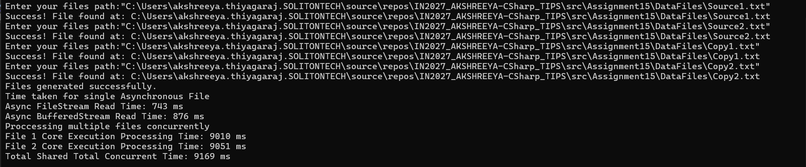

- `CreateLargeFileAsync()` : 1GB file is generated using non blocking I/O operations if the target does not already exist 
- `ReadWithFileStream()` : Reads the file sequentially in small chunks of the mentioned bufferSize asynchronously  
- `ReadWithBufferedStreamAsync()` : wraps the file stream in a larger internal 1MB memory buffer to read and write the data asynchronously in larger segments.
- `ProcessData()` : read the file by FileStream and converts the data to uppercase chunk by chunk
- `WriteToMemoryStream()` : Temporarily buffers the data into a memorysteam before asynchronously copying it to destination file

- Unlike the synchronous verision where bufferedstream was faster, here Async file stream executed faster than  bufferedstream because adding a second asyncronous wrapper for buffered stream introduces additional overhead.

- In aynchronous file reading We can find that the File1 took `9010 ms` and file2 had tool `9051 ms` if this was executed syncronously the total time would have taken around `18000 ms` however reading it asynchronously the total time took is `9169 ms` 