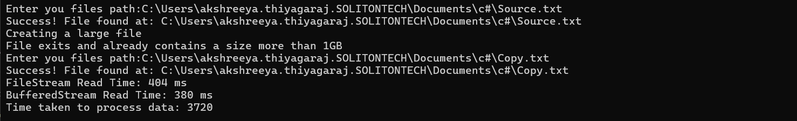

- `CreateLargeFile()` : 1GB file is generated 
- `ReadWithFileStream()` : Reads the file sequentially in small chunks of the mentioned bufferSize 
- `ReadWithBufferedStream()` : wraps the file stream in a larger internal 1MB buffer to read and write the data in larger segments.
- `ProcessData()` : read the file by FileStream and converts the data to uppercase 
- `WriteToMemoryStream()` : Writes the processed data to destination file using memoryStream
- Buffered stream performed better than filestream as it reduces the overhead by fetching a  1MB block into its internal buffer memory and reads from it.
- this eliminates the need to ask the operating system for physical access frequently which the fileStream does.
