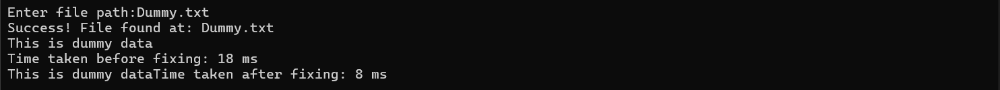

- Before optimization : 
    - Unnecessary double buffer allocation during write operation 
    - Allocates new byte array on managed heap while calling `.ToArray()` triggering Garbage collection frequently which is expensive.
    - Character by character casting results in massive overhead compared to bulk decoding

- After optimization : 
     - writing file directly using filestream allows bytes to be written directly to the disk 
     - direct string decoding rather than charecter-byte casting 