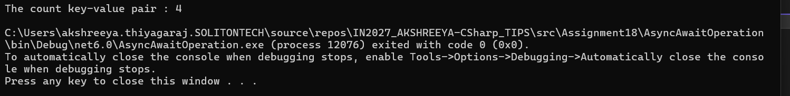

- `MethodA()` : this method performs CPU bound work of calculting sum simulating perfomance of complex calculation, this is done using `Task.Run()` where the calculated result is returned 
- `MethodB()` : awaits for `MethodA()`, uses its result to construct a URL and makes a asynchronous HTTP request.
- `MethodC()` : awaits for `MethodB()` where it gets the JSON response and returns the deserializes dictionary count of key-Value pairs.
- this program siulates the real world application of analyzing the data, triggering web service calls and serializing the data from the calls without blocking any work. This is achieved by async/await where each dependent operations waits without blocking the other