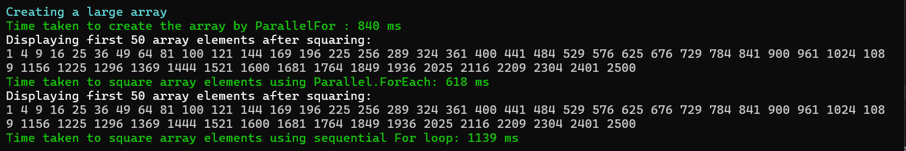

- This task helps in understanding how parallel operation is efficient than sequential 
- `CreateArray` : Creates array using `Parallel.For` of given array size
- `SquareArraySequentially` : performs sequential squaring operation on the array using for loop, displays the array and returns the time taken to perform the operation. 
- `SquareArrayParallely` : Performs parallel operation the array using `Parallel.ForEach`, displays the array and returns the time taken to perform the operation
- `DisplayArray` : Displays the first 50 element of the given array
- `DisplayMessage` : Displays the given message in the given color format

OBSERVATION:

- We can observe that sequential for loop takes more time to calculate square of array elements where as Parallel.ForEach takes lesser time,
- this is due to sequential loop processes iterations one after another on one thread. A parallel loop divides independent iterations among multiple thread-pool threads.