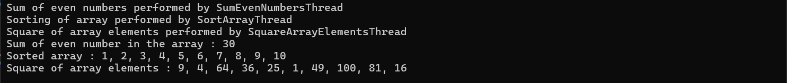

- `array` : a static array with unordered elements
- `SqaureArrayElements` : Squares array elements in `SquareArrayElementsThread`
- `SortArray` : Sorts the given array in ascending order in `SortArrayThread` 
- `SumEvenNumbers` : Sums even numbers in the array in `SumEvenNumbersThread` 

Observation : 
- This program uses multiple threads to perfrom different operation
- `.Join` waits for all thread to complete and displays the result at end
